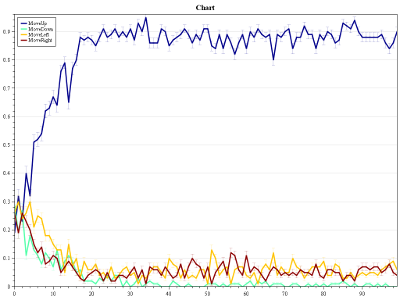

# Socio-Emotional IMRL
> Socio-Emotional Reward Design for Intrinsically-Motivated Reinforcement Learning Agents - C# code

This repository contains the code used to produce the results in:

- Sequeira, P. (2013). [Socio-emotional reward design for intrinsically motivated learning agents](https://web.northeastern.edu/cesar/psequeira/wp-content/blogs.dir/2/files/papercite-data/papers/sequeira2013phdthesis.pdf). *Ph.D. Thesis. IST / Universidade de Lisboa*.

The code is open-source under the [MIT license](https://github.com/SocioEmotionalIMRL/Genetica/blob/master/LICENSE.md).

- Source repository: https://github.com/pedrodbs/SocioEmotionalIMRL

Supported platforms:

- .Net 4.5+ on Windows, Linux and Mac

**Notes:** 

- The code was last updated around 2013, has not been used in recent works and is not being maintained;
- The *PacMan scenarios* are working but the *GP-based IMRL features* are not fully working (todo).


## Table of Contents

  * [About](#about)
  * [Usage](#usage)
    + [Running Single Tests](#running-single-tests)
      - [Results](#results)
    + [Running Optimization Tests](#running-optimization-tests)
        * [Results](#results-1)
      - [Linearly-Parameterized Optimization](#linearly-parameterized-optimization)
        * [Results](#results-2)
    + [Adding Reward Features](#adding-reward-features)
  * [Packages](#packages)
  * [Dependencies](#dependencies)
  * [Other Publications](#other-publications)

------

## About

The work behind the code focused on developing flexible and robust mechanisms for autonomous agents within the *reinforcement learning* (RL) computational framework. The problem is to design *reward mechanisms* that allow an agent to learn a task as efficiently as possible having into account its limitations. Another challenge is to create rewards that are generic enough to be used in a wide variety of situations, *i.e.*, not only for a specific task or domain.

The code implements the *intrinsically-motivated reinforcement learning* (IRML) framework, an extension to RL where an agent is rewarded for behaviors other than those strictly related to the task being accomplished, *e.g.*, by exploring or playing with elements of its environment. The following is provided by the code:

- A set of four domain-independent reward features based on *appraisal theories of emotions*, that when linearly-combined can guide the learning process of IMRL agents acting in different dynamic environments over which they have only *limited perceptions*;
- A *genetic programming* (GP) procedure to evolve general-purpose, domain-independent intrinsic reward functions. Specifically, the functions use information that is produced by any standard RL algorithm as the building blocks for GP to discover interesting sources of information to complement the agent’s perceptual capabilities in partially-observable environments;
- An extension of the IMRL framework to *multiagent settings* involving complex interdependences between the behaviors of several interacting agents, each using a particular intrinsic reward function. In particular, includes generic social rewards inspired in natural mechanisms of reciprocation that enable the emergence of socially-ware individual behaviors within competitive multiagent scenarios.

## Usage

To install, `git clone` the [source code](https://github.com/pedrodbs/SocioEmotionalIMRL) and use an IDE like VisualStudio to edit and build the binaries. Select `x64` as the solution platform and `Debug` or `Release` as the solution configuration to debug the code or simply run simulations, respectively.

### Running Single Tests

*Single tests* run a number of simulations over the same environment and according to some reward function parameterization. For example, to test the *Persistence* environment using an emotion-based agent with a linearly-parameterized reward function, we first set the parameters:

```c#
var testsConfig = new EmotionalTestsConfig();	// loads default test configuration
testsConfig.SetDefaultConstants();
testsConfig.SingleTestType = (uint) TestType.Persistence;
testsConfig.SingleTestParameters = new ArrayParameter(new[] { -0.10, 0.10, -0.10, 0.10, 0.60 });
testsConfig.Init();
```

Or edit the `*TestsConfig.cs` configuration file directly, which contains all parameters of the simulation, such as the number of *time-steps*, number of *simulations/runs*, *learning rate*, *discount factor*, etc.

Then to run the simulations:

```c#
var programRunner = new ProgramRunner(
    testsConfig,
    new EmotionalSingleTestRunner(testsConfig), 
    new OptimizationScheme(new ListFitnessTest(null), new List<TopTestScheme>()));
programRunner.Run(null);
```

This will bring up a menu with several options:


If we select the first option, `Single Test (...)`, another menu will appear:


To simply run the test in the console (no visualization) and get back the results of all simulations/runs, select `Run on console`, otherwise selecting `Run visual form` will bring up an environment visualizer:


Here we can control each simulation in sequence by *pausing* the simulation, *advancing* a certain number of time-steps, checking the *fitness* of the agent, the *actions* chosen, etc. 

We can also *control the actions* of the agent by first selecting the environment window (the middle one) and then pressing the *arrow keys* (Up, Down, Left, Right) corresponding to each of the directions.

#### Results

After all simulations have finished, we can check the results in the corresponding output directory, *e.g.*, `.\PS.Learning\Tests\EmotionalOptimization\bin\Release`. Results are organized by environment, then by reward function parameter, then by topic. For example, the *mean fitness progress* during the simulations is saved in the CSV file `CumulativeFitnessAvg.csv`, which has the corresponding plot file:


The *mean frequency of the actions* selected by the agent can be found in `Behavior/ActionsAvg.png`, which would produce something like the following plot, where the blue line represents the *Move-up* action:




### Running Optimization Tests

*Optimization tests* run a different number of simulations over the same environment in order to test different reward function parameterizations and select the best one. 

####Genetic Programming Optimization

To determine the best reward function for a GP-based agent, we first set the parameters:

```c#
var testsConfig = new EmotionalGPTestsConfig();	// loads default test configuration
testsConfig.SetDefaultConstants();
testsConfig.AllowedFunctions = FlexibleGPGene.AllFunctions;
testsConfig.Constants = new[] {0d, 1, 2, 3, 5};
testsConfig.Init();
```

In the above example we also set the function set and constant set. To change all other parameters edit the corresponding configuration file, *e.g.*, `EmotionalGPTestsConfig.cs`. 

To run the optimization procedure, we define some *optimization scheme*:

```c#
var simplifierTest = new GPSimplifierFitnessTest(null);
var programRunner = new ProgramRunner(
	testsConfig, new FormsSingleTestRunner(testsConfig),
	new GPOptimizationScheme(
		new ECParallelOptimTest(null), 208,
		new List<TopTestScheme>
		{
			new TopTestScheme(500, 10),
			new TopTestScheme(250, 20),
			new TopTestScheme(100, 50),
			new TopTestScheme(10, 100),
			new TopTestScheme(5, 200),
			new TopTestScheme(1, 200)
		}, simplifierTest));
programRunner.Run(args);
```

In the above example, the GP optimization procedure is going to first run several populations to determine the best reward functions, testing each candidate for a pre-determined number of simulations/runs (set in the `*TestsConfig.cs` configuration file), then it is going to run the top 500 candidates for 10 simulations each, then the top 250 for 20 simulations each, ..., and finally the top-5 candidates are going to be run for 200 simulations each in order to determine their fitness. In the end, a simplification procedure tries to shorten the GP expressions of the best candidates.

Running this code will bring up the main menu:


We now select `Optimization Test` and let the procedure complete. 

##### Results

After GP optimization, we can check the results in the corresponding output directory, *e.g.*, `.\PS.Learning\Tests\RewardFunctionGPOptimization\bin\Release`. Results are organized by optimization scheme phase:

- The results for the main GP *optimization phase* are stored in directory `EvoOptimization`. The file `ChromosomesHistoryEvoOptimization.csv` contains the list of all GP reward functions tested during the evolutionary procedure, along with fitness information, the minimal generation in which the function was produced, the number of times it was produced, etc.;
- The results of the reward function expression simplification are stored in `ExpressionSimplify`;

#### Linearly-Parameterized Optimization

To determine the best linearly-parameterized reward function we first set the parameters:

```c#
var testsConfig = new EmotionalTestsConfig();	// loads default test configuration
testsConfig.SetDefaultConstants();
var stepInterval = new StepInterval<double>(-1, 1, .1);
testsConfig.ParamsStepIntervals = StepInterval<double>.CreateArray(stepInterval, NUM_FEATURES);
testsConfig.Init();
```

In the above example, `stepInterval` defines how the parameters, *i.e.*, the weights for each reward feature, are going to be *sampled*. In this case, each parameter is going to be sampled from -1 to 1 in steps of 0.1. *All the combinations* of these parameters values are going to be tested as *parameter vectors* during optimization. To change the other configurations edit the corresponding file, *e.g.*, `EmotionalTestsConfig.cs`. 

We also define an *optimization scheme* to run the optimization procedure:

```c#
var programRunner = new ProgramRunner(
	testsConfig, new EmotionalSingleTestRunner(testsConfig),
	new OptimizationScheme(
        new ListFitnessTest(null),
		new List<TopTestScheme>
		{
			new TopTestScheme(500, 10),
			new TopTestScheme(250, 20),
			new TopTestScheme(100, 50),
			new TopTestScheme(10, 100),
			new TopTestScheme(5, 200),
			new TopTestScheme(1, 200)
		}));
programRunner.Run(args);
```

Running this code will bring up the main menu:


We select `Optimization Test` and let the procedure complete. 

##### Results

After the optimization, we can check the results in the corresponding output directory, *e.g.*, `.\PS.Learning\Tests\EmotionalOptimization\bin\Release`. Results are organized by optimization scheme phase, where `TestMeasures.csv` provides the fitness attained for the reward function of each parameter vector.

### Adding Reward Features

To add a new set of intrinsic reward features for linearly-parameterized IMRL, we create a new *motivation manager* class and implement the function getting the features according to the *state transition* $s,a,s'$:

```c#
public class EmotionalMotivationManager : ArrayParamMotivationManager
{
	public override DenseVector GetRewardFeatures(uint prevState, uint action, uint nextState)
	{
		return new DenseVector(new[]
			{
				this.GetFeature1(prevState, action),
				this.GetFeature2(prevState, action),
				...
				this.GetExtrinsicReward(prevState, action)
			});
	}
}
```

Then in the `*TestsConfig.cs` configuration file we change a few parameters to meet the newly-defined features, *e.g.*: 

```c#
this.ParamIDNames = new[] {"Feature1", "Feature2", "Feature3", ..., "Fit. Param"};
this.ParamIDLetters = new[] {'a', 'b', 'c', ..., 'z'};
this.ParamsStepIntervals = StepInterval<double>.CreateArray(stepInterval, NUM_FEATURES);
```

## Packages

- **Core:** definitions for environments, agents, actions, etc., and all the RL algorithms; 
- **EvolutionaryComputation:** evolutionary algorithm to optimize reward functions as genetic programs;
- **Forms:** visual representation of all the environments;
- **IMRL:** definition of intrinsic reward functions;
  - **IMRL.Emotions:** emotion-based intrinsic reward features;
  - **IMRL.EC:** reward functions as genetic programs;
- **Social:** 
  - **Social.IMRL:** extension of IMRL reward functions for multiagent settings;
  - **Social.IMRL.EC:** multiagent reward functions for multiple agents;
- **Tests:** 
  - **EmotionalOptimization:** simulations for emotion-based single-agent IMRL (linearly-parameterized);
  - **AltruismOptimization:** simulations for social-based, multiagent IMRL (linearly-parameterized)
  - **RewardFunctionGPOptimization:** simulations for single-agent GP-based IMRL;
  - **AltruismGPOptimization:** simulations for multiagent GP-based IMRL (same reward function for all agents);
  - **MultiRewardFunctionGPOptimization:** simulations for multiagent GP-based IMRL (different reward functions for each agent);
- **Utils.EnvironmentEditor:** utility to edit and create new grid-world environments;
- **Utilities.*:** contains several utility methods for math, serialization, collections, etc.

## Dependencies

- [AForge.NET](http://www.aforgenet.com/) ([custom build](https://github.com/pedrodbs/AForge.NET) based on 2.2.4)
- [CommandLineParser](https://github.com/commandlineparser/commandline) (1.9.71)
- [Math.NET Numerics](https://numerics.mathdotnet.com/) (4.4.0)
- [Json.NET](https://www.newtonsoft.com/json) (11.0.2)
- [OxyPlot](http://www.oxyplot.org/) (1.0.0)

## Other Publications

Other works that used (possibly earlier) versions of this code:

1. Sequeira, P., Melo, F. S., & Paiva, A. (2011). [Emotion-based intrinsic motivation for reinforcement learning agents](https://web.northeastern.edu/cesar/psequeira/wp-content/blogs.dir/2/files/papercite-data/papers/sequeira2011acii.pdf). In *International Conference on Affective Computing and Intelligent Interaction* (pp. 326-336). Springer, Berlin, Heidelberg.
2. Sequeira, P., Melo, F. S., & Paiva, A. (2014). [Learning by appraising: an emotion-based approach to intrinsic reward design](https://web.northeastern.edu/cesar/psequeira/wp-content/blogs.dir/2/files/papercite-data/papers/sequeira2014adb.pdf). *Adaptive Behavior*, *22*(5), 330-349.
3. Sequeira, P., Melo, F. S., & Paiva, A. (2015). [Emergence of emotional appraisal signals in reinforcement learning agents](https://web.northeastern.edu/cesar/psequeira/wp-content/blogs.dir/2/files/papercite-data/papers/sequeira2014jaamas.pdf). *Autonomous Agents and Multi-Agent Systems*, *29*(4), 537-568.
4. Sequeira, P., Melo, F. S., Prada, R., & Paiva, A. (2011). [Emerging social awareness: Exploring intrinsic motivation in multiagent learning](https://web.northeastern.edu/cesar/psequeira/wp-content/blogs.dir/2/files/papercite-data/papers/sequeira2011icdl.pdf). In *Development and Learning (ICDL), 2011 IEEE International Conference on* (Vol. 2, pp. 1-6). IEEE.

------

Copyright &copy; 2018, [Pedro Sequeira](https://github.com/pedrodbs)